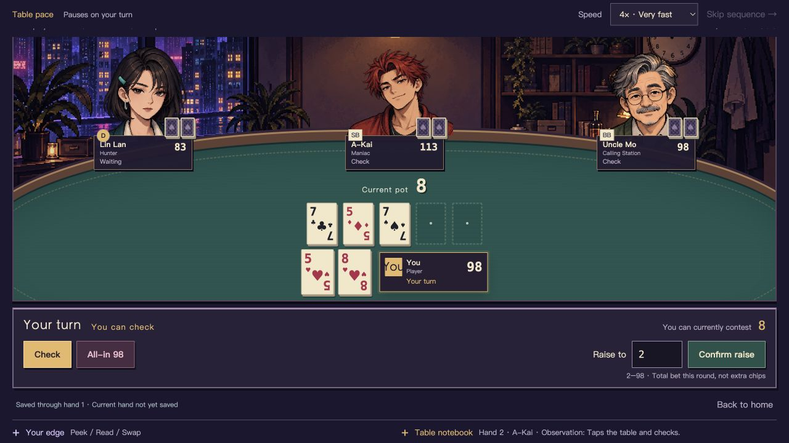

# Holdem Game Engine — Night Table

[English](README.en.md) · [简体中文](README.md)

A TypeScript No-Limit Texas Hold'em engine with a playable, pixel-art single-player table. Meet distinct opponents, learn the rules at the table, or try three optional cheating abilities.

**[Play in English →](https://amatate.github.io/holdem-game-engine/?lang=en)** · [Play in Chinese](https://amatate.github.io/holdem-game-engine/?lang=zh) · [Deployment status](https://github.com/amatate/holdem-game-engine/actions/workflows/pages.yml)

No download, account, or API key. Virtual chips only: no deposits, withdrawals, or real-money betting. This is a single-player prototype, not online multiplayer.

## Language

Use **语言 / Language → English** in the top bar. Both the hosted browser edition and the local Node edition support English and Chinese. You can switch during a hand without restarting the table, changing chips, or losing a typed raise.

The interface covers the lobby, actions, showdown, tutorials, abilities, story, NPC dialogue, observations, and status/error messages. Share `?lang=en` or `?lang=zh` to open a particular language. Otherwise your saved preference takes priority, followed by your browser language (Chinese for Chinese-language browsers; English otherwise).

The CLI and underlying API remain in their original language. Language is a display setting, not a separate rules engine.

## Screenshots

These are real browser captures, not concept art. Cards, chip counts, and actions are interactive elements layered over the room and character artwork.



<details>
<summary>Earlier feature screenshots (Chinese interface)</summary>


</details>

## What's playable

- **Classic Hold'em:** choose 2–6 players. You occupy seat 0; the game fills the other seats with a fixed, non-repeating NPC lineup for that table size.
- **Ability Lab:** optional Peek, Read, and Swap abilities. Classic rules remain available without them.
- **Three beginner lessons:** Uncle Mo teaches hole cards, blinds, calling/checking, raising/folding, and showdown. The first two lessons guide your actions; an incorrect guided action does not spend chips or advance play. Each lesson ends with a question.
- **A Seat for You:** a short four-player prologue with Lin Lan, A-Kai, and Uncle Mo, lasting up to six hands, with dialogue choices and a farewell even if you bust early.
- **Table personalities:** optional short dialogue, observed actions, public memories, and bounded strategy changes in free play. Speech is distinct from observation; NPCs do not read hidden opponent cards.
- **Paced playback:** deal, bets, community cards, reveals, and payouts play step by step. Choose 0.5×, 1×, 2×, or 4×, or skip to the next decision. Playback pauses on your turn and supports reduced motion.
- **Hand results:** best five cards, hand category, each pot's winners, committed chips, uncalled returns, and net results. Review recent encounters in the table notebook.
- **Local checkpoints:** save at completed-hand boundaries, including relevant ability charges, tutorial progress, and character/story state.

The rules engine handles action order, minimum raises, short all-ins, reopening raises, uncalled returns, main/side pots, ties, odd chips, eliminations, and escalating tournament blinds. It evaluates all nine hand categories.

### Meet the opponents

| Character | Style |
| --- | --- |
| Lao Zhou — Rock | Tight, steady, risk-averse |
| Lin Lan — Hunter | Position-aware and willing to apply pressure |
| A-Kai — Maniac | Loose, aggressive, volatile |
| Uncle Mo — Calling Station | Sticky caller, rarely the aggressor |
| Cheng Mo — Small Ball | Smaller pots and lighter pressure |
| Su Man — Viper | Selective counterattacks, traps, and slow play |
| Han Lie — Hammer | Value-oriented play and larger value bets |

They share a parameterized strategy rather than seven independent solvers. When personalities are enabled, the three core characters also react to recent public actions, with memories bounded to eight hands. There is no LLM chat, GTO solver, or learning across separate games. The three core characters have runtime portraits; the remaining opponents currently use silhouettes.

## Run locally

Requires **Node.js 22+** and npm.

```bash
git clone https://github.com/amatate/holdem-game-engine.git
cd holdem-game-engine
npm ci
npm run web
```

Open the address printed in the terminal, normally [http://127.0.0.1:4173/?lang=en](http://127.0.0.1:4173/?lang=en). Choose the table size and mode, then **Sit down & deal**. Both Classic and Ability Lab use the same service.

If the port is busy:

```bash
HOLDEM_PORT=4174 npm run web
```

Stop with Ctrl+C. There is no hot reload; rerun `npm run web` after source changes.

### Build the hosted edition locally

```bash
npm run build:pages
npm run preview:pages
```

Open the printed `/holdem-game-engine/` address and append `?lang=en`. This edition runs the same game engine inside a browser Web Worker. The GitHub Pages workflow checks, builds, tests, and deploys it on updates to `main`.

### Terminal mode

```bash
npm run play -- --players 4 --seed demo-4p
npm run play -- --players 6
npm run play
```

The terminal remains **Chinese-language Classic mode**. Without `--players`, it asks for 2–6 players; an empty answer selects four. A seed plus the same actions reproduces a Classic game.

| Input | Action |
| --- | --- |
| `f` | Fold |
| `x` | Check |
| `c` | Call |
| `r 20` | Raise **to** 20 total this round |
| `a` | All-in |

Only currently legal actions are offered. A call is not a substitute for a check; use `x` when checking.

## Abilities and information boundaries

Each ability has **one use per game**, not per hand. You can use at most one ability per decision, then still take a normal poker action. Abilities do not cost chips.

| Ability | Effect |
| --- | --- |
| Peek | Reveal one randomly selected real hole card of an eligible opponent, privately |
| Read | Estimate an eligible opponent's strength as weak, medium, or strong at that street; not a win guarantee or live-updating read |
| Swap | Replace one of your hole cards with the next undealt card; no preview or undo |

Swap removes the old card from that hand and shifts subsequent dealing accordingly. Opponents must still be in contention and not already have publicly revealed their cards. Private intel does not enter public logs or NPC observations and expires after the hand.

Classic games disable abilities entirely. Tutorials always use Classic rules. Free play and the prologue can use either mode, fixed when that table starts.

## Hosted vs. local saves

| | GitHub Pages | Local Node table |
| --- | --- | --- |
| Engine | Browser Web Worker | Local Node service |
| Checkpoint | IndexedDB on this website, one slot | `.holdem-data/<port>/`, one slot per browser identity |
| Refresh | Return home; restore the last settled hand | An active in-memory table can retain an unfinished hand |
| Hidden information | Inspectable by someone controlling their own browser | Undisclosed cards and deck remain on the local server |
| Account/cloud sync | None | None |

On Pages, tabs have separate games but share one checkpoint slot; competing saves report a conflict instead of silently overwriting it. An unfinished hand is not checkpointed. Start a new game to replace a previous checkpoint **when the new game's first hand settles**.

Use **Continue game** at the home screen to restore a completed hand. Clearing website data, using a different browser/device, or changing the origin can lose access to local progress. Node users should keep the same port, hostname, and browser; `localhost` and `127.0.0.1` are different identities.

Restoring validates a strict code fingerprint and replay summary. **An update, including this language update, may make an old save incompatible.** The game explains this and keeps the old data; there is no automatic cross-version migration. Switching languages within the same build does not invalidate saves.

The Pages edition does not upload games, but it is **not tamper-proof and cannot protect hidden cards from the browser's owner**. Node checkpoints are not encrypted and contain private replay data; do not publish `.holdem-data`. Localhost saves are not uploaded or migrated to Pages.

Architecture details: [GitHub Pages](docs/github-pages.md) · [Localization](docs/i18n.md) · [Abilities](docs/peek-ability.md) · [Table personalities](docs/living-table-v2.md). Most older design documents are in Chinese.

## Development checks

```bash
npm run check
npm run build
npx vitest run --maxWorkers=1 --testTimeout=30000
npm run build:pages
```

Run the suite serially to avoid resource contention in long tournament tests. Web-server tests need permission to bind local temporary ports. Coverage includes a fixed-seed 100-hand randomized rules regression, chip conservation, legal actions, replay, and termination. Localization tests cover 2–6 players, three abilities, all tutorial lessons, and story responses with the real engine.

## Scope and feedback

This is a functional rules-and-interaction prototype, not professional poker AI or a finished roguelike. It does not yet include multiplayer, accounts/cloud saves, mid-hand checkpoints, cross-version save migration, NPC abilities/countermeasures, items/upgrades, a full-length story, or long-term character learning.

The `v0.1.0` GitHub Release is the **older terminal MVP**, without the browser table or abilities. Current features live in the repository and Pages deployment; this project is not published on npm.

[Report issues](https://github.com/amatate/holdem-game-engine/issues) with the commit, mode, player count, language, reproduction steps, and expected vs. actual behavior. For CLI rule issues, include the seed and actions. Ability mode does not yet export replays. NPC personality, pacing, beginner clarity, and English wording feedback are especially useful.

## License

No open-source license has been granted. The source is publicly visible on GitHub, but visibility alone does not grant permission to copy, modify, or redistribute it.
