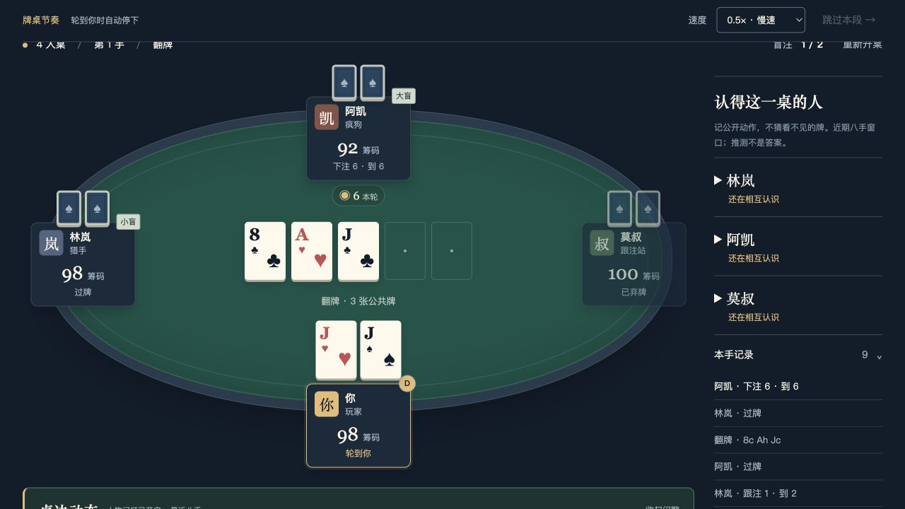
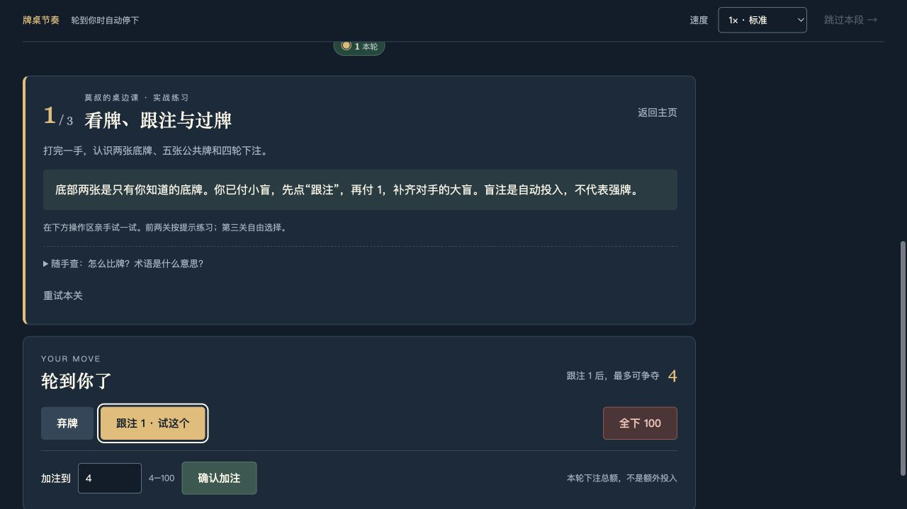
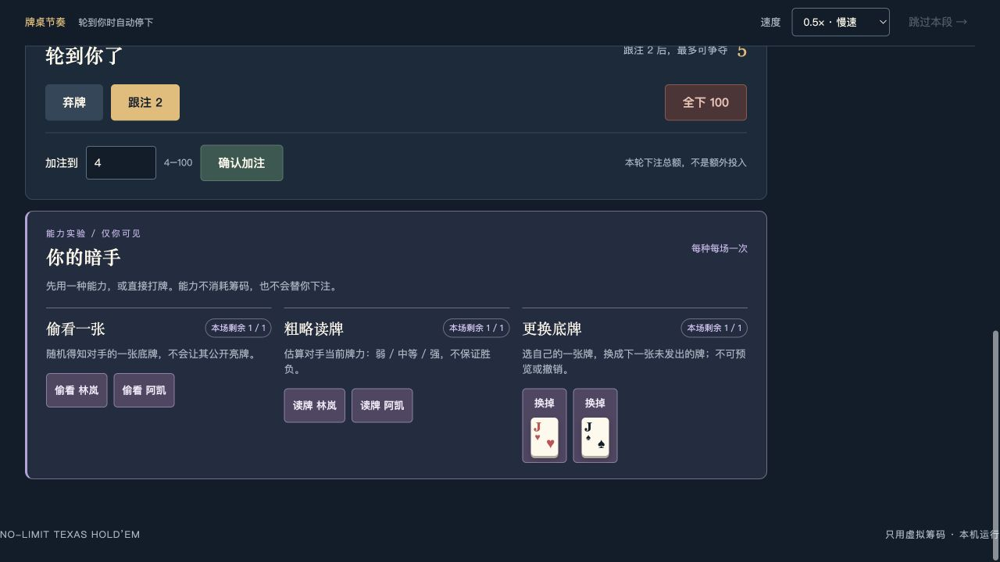

# Holdem Game Engine

一个用 TypeScript 编写的德州扑克（No-Limit Texas Hold'em，NLHE）规则引擎，提供终端和本地浏览器牌桌。

当前源码提供真实德州规则、完整锦标赛流程，以及可选择的 2–6 人终端／浏览器牌桌。你始终坐在物理座位 0，其余座位由固定、确定且不重复的 NPC 阵容自动补齐，直到只剩一名冠军。网页还提供可选的“能力实验”模式，已包含偷看一张、粗略读牌和更换底牌三种能力；尚未加入肉鸽成长。

> GitHub 的 `v0.1.0` Release 是早期终端 MVP，不包含浏览器牌桌和三种能力；后续功能见源码更新记录，未发布为 npm 软件包。项目使用虚拟筹码，不涉及充值、提现或真钱下注。

## 游戏截图

以下为 2026-09-16 当前源码的真实浏览器截图，不是概念图。游戏在本机运行，暂未提供在线试玩服务。

### 入座「夜局」

四人牌桌的翻牌圈：公共牌、自己的底牌、筹码、最近行动与人物观察。其他玩家未亮出的底牌保持隐藏；截图中的牌局使用能力实验规则，经典德州也可独立选择。



<details>
<summary>主页：教学、短剧情与自由开桌</summary>

第一次玩可以跟莫叔学三手，也可以进入「留一张椅子」短序章，或自己选择 2–6 人自由牌桌。


</details>

<details>
<summary>新手教学：边打边学，不先背规则</summary>

跟随当前牌局解释底牌、盲注与下注动作，并直接标出建议尝试的按钮；使用真实规则引擎和配合练习的对手。



</details>

<details>
<summary>能力实验：偷看、读牌、换牌</summary>

三种能力各自每场一次。获取信息或更换底牌后，仍需自己完成正常的德州决策；能力模式不是经典模式的必选项。



</details>

[马上在本机开一桌 ↓](#安装与运行) · [截图来源与版本](docs/screenshots/README.md)

## 当前内容

- 52 张标准牌组、洗牌、发底牌和公共牌
- 按钮位、小盲、大盲与各下注轮的正确行动顺序
- 弃牌、过牌、跟注、下注、加注和全下
- 最小加注、短码全下、加注权重开与自动发完公共牌
- 未被跟注筹码退还、主池/边池、平分底池与奇数筹码分配
- 九类牌型比较，并在摊牌时显示牌型与实际最佳五张
- 2–6 人可选终端牌桌；人类玩家固定在物理座位 0，其余座位按桌子人数自动填入固定、确定且不重复的 NPC 阵容
- 淘汰、盲注升级和锦标赛结束流程
- 经典模式固定种子重放：相同种子配合相同行动可复现牌局；能力模式暂不提供保存／导出回放
- 只向角色 AI 提供其应当看到的信息，不泄露其他玩家底牌
- 终端通过经典 `GameSession` 接收冻结的决策、单手结算和比赛结果 TurnPacket；终端不读取核心 authority state

原有的公开 `runTournament()` API 保持可用。packet 风格终端是在同一套规则与锦标赛流程之外增加的交互边界，不会要求既有调用方改用 CLI。

内置七名角色：

- 老周“岩石”：紧、稳健、低风险
- 林岚“猎手”：重视位置，主动施压
- 阿凯“疯狗”：宽松、激进、变化大
- 莫叔“跟注站”：宽松、黏性强、很少主动加注
- 程墨“小刀”：小底池、轻量施压、较少过度承诺筹码
- 苏蔓“伏蛇”：善于慢打与设陷阱，选择性反击
- 韩烈“重锤”：偏好价值下注与更大的价值尺寸

七名角色以同一套共享、参数化策略为基础，不是七套独立求解器。网页开启人物互动时，林岚、阿凯、莫叔额外使用有界的角色策略与近期公开记忆；不是大模型或长期学习的智能体。没有手动选择 NPC，也没有随机分配阵容；每个桌子人数对应固定的自动阵容。省略 `--players` 时，终端会显示精确的 2–6 人选择提示；空输入会默认使用历史兼容的四人桌阵容：人类玩家、猎手、疯狗、跟注站。

## 环境要求

- Node.js 22 或更高版本
- npm

## 安装与运行

浏览器试玩（Node.js 22+）：

```bash
git clone https://github.com/amatate/holdem-game-engine.git
cd holdem-game-engine
npm ci
npm run web
```

打开终端打印的地址，默认 `http://127.0.0.1:4173/`。选择人数和玩法后入座；经典模式与能力模式使用同一个服务，无需 API Key。

### 主页的新手教学与活牌桌

- **开始新手教学**：莫叔陪练三关——看牌／跟注／过牌，加注／弃牌，自由练习／摊牌。使用固定种子和配合练习的对手，真实规则引擎发牌结算；前两关点错指导动作不推进牌局、不扣筹码，每关答题后解锁下一关。可重试、返回主页、刷新恢复；最后一关完成后可直接开经典牌桌。
- **走进「留一张椅子」**：玩家、林岚、阿凯、莫叔四人短序章，最多六手，提前淘汰也能收尾。NPC 根据近期八手公开行动作有界的策略调整，并有事件短句、情绪回落、人物观察和开场／局中／离桌的简短回应选项。收起闲聊不影响打法；观察区区分事实与推测。
- **自由开桌 + 人物记忆与闲聊**：主页默认勾选，2–6 人、经典／能力都能使用，不带剧情、不限制六手。取消勾选后使用原有 NPC 风格参数。此选项新开桌时生效；旧 API 未传 `socialEnabled` 时保持关闭。
- 人物气泡分为浅色「发言」和绿色「观察」，后者只描述已经发生的过牌、扣牌、投入筹码等动作，不是读心。跟随倍速与跳过，每手普通发言最多两条、观察最多两条，重大结果回应另有名额。牌桌下、操作区上方的「桌边动态」可回看；收起闲聊仍保留动作观察与记忆提示。
- 开启人物互动后，林岚会延续／收敛上一街的进攻，并参考重复施压、公开摊牌记录；阿凯大额输赢后的风格变化在接下来三手衰减，第四手消退；莫叔仍愿意小额跟注，但会收紧昂贵的跟注。变化影响实际合法决策，不保证某手一定采用指定动作，也不代表职业水平。
- 第一手就记录首次行动；连续施压、公开摊牌或大底池交锋可再留一条关键记忆，最多保留最近八手。至少三手可见行动才形成谨慎推测。结算后显示投入／退回核对过的「本手交锋」回顾，不解释未公开底牌或把高牌进攻直接称为诈唬。
- 序章使用主页下方选定的经典／能力规则，自带人物互动；教学始终使用经典规则和配合练习的对手。
- 人物记忆与教学进度只保存在当前本地服务会话，重开重置、重启服务丢失。没有大模型聊天、长期学习、永久关系存档或完整长篇剧情。

规则与验收说明见 [docs/living-table-v1.md](docs/living-table-v1.md)，普通桌接入与反馈说明见 [docs/living-table-feedback.md](docs/living-table-feedback.md)，最新角色策略与两类气泡见 [docs/living-table-v2.md](docs/living-table-v2.md)。

终端试玩：

```bash
npm run play -- --players 4 --seed turn-packet-human-v1
npm run play -- --players 6 --seed demo-6p
npm run play -- --players 2
npm run play
```

`--seed` 用来固定随机种子，便于复现和讨论同一局牌。`--seed` 与 `--players` 可以任意顺序提供，但每个选项最多出现一次。

## 操作方式

### 浏览器牌桌（本地）

在克隆后的项目目录运行：

```bash
npm run web
```

打开终端打印的 Local 地址，默认是 `http://127.0.0.1:4173/`。选择 2–6 人（默认 4 人），点击“入座发牌”。浏览器提供真正合法的弃牌、过牌、跟注、加注和全下按钮；“加注到”仍表示本轮下注总额。

- 开桌前选择“经典德州”（默认）或“能力实验 · 三种能力”。模式整场固定，切换需重新开桌。
- 三种能力各自每场一次，用完后下一手不恢复；每次轮到你时最多用一种，成功后仍需正常打牌，不扣筹码。
- 偷看：点击“偷看 [对手]”，随机获知其一张真实底牌。
- 读牌：点击“读牌 [对手]”，得到弱／中等／强的估算；标注读取时轮次，不自动更新，也不保证胜负。
- 换牌：点击“换掉 [自己的牌]”，用下一张未发出的牌替换它。不能预览或撤销；旧牌退出本手，后续公共牌自然顺延，结算使用新牌。
- 仅能选择仍有底池资格且未亮牌的其他对手。情报只出现在“本手私有情报”区，刷新可恢复，本手结束后清除；对手牌面和公共日志不会因此亮牌，NPC 不接收情报。
- 筹码、位置、公共牌和角色最近行动在牌桌上显示；右侧是角色风格和本手记录。
- 发牌、行动、公共牌、亮牌和派奖按事件逐步播放。顶部可选 0.5×、1×（默认）、2×、4×，切换立即影响当前步骤，速度保存在本机浏览器。
- 点击“跳过本段”立即到达下一次决策或结算；播放期间不能重复下注，轮到你时自动停下。系统启用“减少动态效果”时保留逐步节奏，但关闭移动和翻转。
- 每手停在结算表，展示各池赢家、实际最佳五张、投入、退回和净结果；点击“下一手”继续，淘汰后可继续观看。
- 刷新会恢复同一浏览器的当前牌桌；不同标签页共享本地会话。操作期间按钮锁定，旧页面命令不会重复下注或操作新桌。
- 刷新／断线恢复直接同步引擎的实际状态，不重播旧动画、不重复提交操作；动画不会改变发牌、NPC 决策或结算。
- 状态只保存在本地服务内存；重启服务或闲置超过两小时会丢失牌局，不是永久存档。
- 只监听本机，不支持远程访问或真人联机。牌库、随机种子和未经授权的对手底牌留在 Node 引擎端；网页只接收公共状态、自己的手牌和成功使用能力后获准看到的私有情报。
- 如端口已占用：`HOLDEM_PORT=4174 npm run web`。停止服务按 `Ctrl+C`。
- 修改源码后重新运行 `npm run web` 编译；本版没有热更新。服务重启后请重新开桌。

终端玩法保持原样：

```bash
npm run play -- --players 4
```

### 终端输入

终端每次会列出当前真正合法的操作：

| 输入 | 含义 |
| --- | --- |
| `f` | 弃牌 |
| `x` | 过牌 |
| `c` | 跟注 |
| `r 20` | 加注到 20，而不是额外再加 20 |
| `a` | 全下 |

例如提示 `r 4-100 加注到` 时，输入 `r 20` 表示把本轮下注总额加到 20。不能过牌时需要跟注或弃牌；当前版本中，面对“过牌”场景请使用 `x`，不能用 `c` 代替。

终端按 TurnPacket 渲染语义块：连续的普通行动会在同一块中输出；翻牌、转牌、河牌、摊牌和结算等阶段切换前保留可感知的停顿。轮到你行动时，牌桌状态和操作菜单会立即完整显示，不会额外等待 1 秒。

## 验证

```bash
npm test -- --maxWorkers=1
npm run check
npm run build
```

测试包含固定种子的 100 手随机规则回归，覆盖 2–6 人桌、多种初始筹码和盲注组合；这用于检查筹码守恒、合法行动、事件回放和牌局能否正常结束。推荐串行运行完整测试，避免资源竞争导致锦标赛测试超时；Web 服务测试需要允许监听本机临时端口。

## 反馈

欢迎在 [GitHub Issues](https://github.com/amatate/holdem-game-engine/issues) 反馈试玩问题。请说明所用提交、经典／能力模式、人数、操作步骤、预期与实际结果；截图请只保留游戏画面。CLI 规则问题可附种子和行动顺序，能力模式目前没有回放导出。尤其希望了解：NPC 牌风是否可辨、动画节奏是否合适、能力是否让决策更有意思。

## 当前源码的开发范围

当前已经是可在终端和本地浏览器游玩的真实规则原型，不是预先写好的对话脚本。它仍是规则与交互 MVP，暂不包含：

- 线上部署、联机与多人真人对战
- 存档、账号与长期局外成长
- NPC 能力、怀疑／反制机制、道具、能力升级或肉鸽事件
- 长期角色学习机制与手动选择 NPC
- 完整长篇剧情、跨场关系存档和赛后策略复盘（现有短序章只有本场记忆与简短关系反馈）
- 求解器级或 GTO 级 AI
- 自定义终端输出速度
- 按牌型语义重新排列最佳五张的显示顺序

当前角色 AI 主要依靠可见信息、牌力估计和风格参数做决定，目标是形成可辨认的性格差异，而不是模拟职业牌手的最优策略。活牌桌的记忆只增加有界启发式调整，不是范围求解器。早期建议归档见 [docs/next-stage-recommendations.md](docs/next-stage-recommendations.md)，其中阶段状态不代表当前实现。

三种能力的规则、信息边界与试玩步骤见 [docs/peek-ability.md](docs/peek-ability.md)。终端仍只支持经典模式；能力模式目前面向网页和 GameSession API。

## 许可证

当前版本未附带开源许可证。源代码可在 GitHub 查看，但这不等于授权复制、修改或分发。
