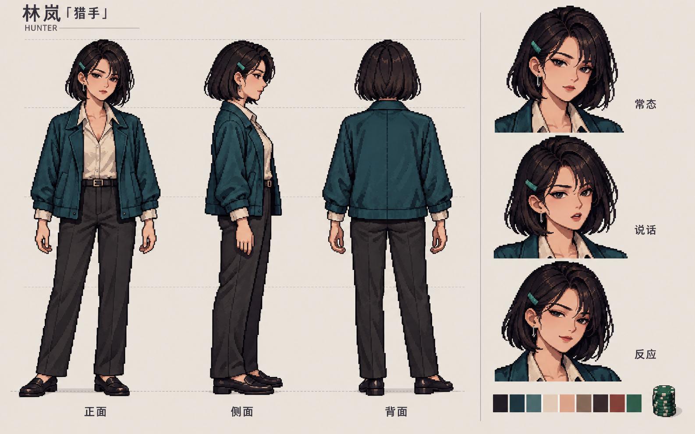
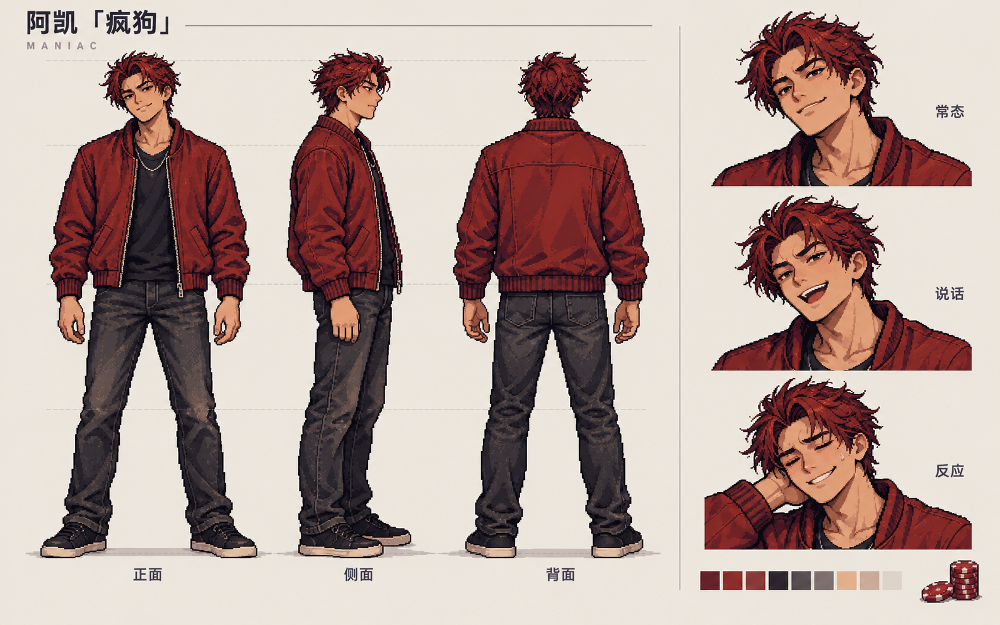
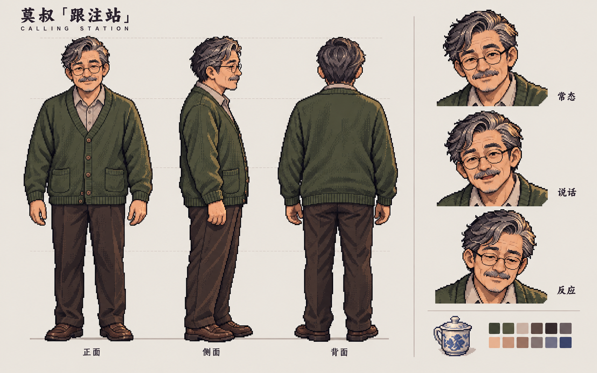

# 夜局核心角色三视图 v1

状态：外形审阅稿；尚未接入游戏。本批先展示人物效果，再进入 UI 升级阶段 A。

这批用内置 image_gen 生成，以 ../concept-01-table.png 作为身份与画风参考，不是编辑原牌桌图。三视图采用不透明浅底用于检查轮廓；不是透明精灵图、动画帧或已经切好的生产立绘。

## 角色预览

### 林岚「猎手」



### 阿凯「疯狗」



### 莫叔「跟注站」



## 本批要确认的内容

- 脸型、年龄感、发型和服装是否符合这三人的性格。
- 像素密度和成年角色比例是否适合上一轮牌桌。
- 正/侧/背轮廓与服装结构是否一致；表情不改变身份。

上半身延续上一轮概念；裤装、鞋和服装背面是这批新增的美术提案，不改动角色故事。表情参考用于公开行动后的演出，不绑定未公开牌力。

## 输出与目视审阅

三张 PNG 均已生成、逐张查看并复制到本目录，尺寸均为 1586×992；原生成文件保留不动。

| 角色 | 审阅结果 | 制作正式立绘时需统一 |
| --- | --- | --- |
| 林岚 | 正/侧/背齐全，短发、青外套和克制表情延续了原概念 | 成图发夹位于角色右侧（正面画面左侧），与提示词指定方向不同；建议按成图统一，不在新表情中左右翻转。耳饰款式与衣领一并锁定 |
| 阿凯 | 正/侧/背齐全，红夹克、乱发、说话与窘笑有辨识度 | 正式表情保持相同脸宽、发际线和项链；窘笑只用于合适的公开反应，不能暗示隐藏牌力 |
| 莫叔 | 正/侧/背齐全，灰发、眼镜、开衫与年龄感清楚 | 衣襟底部纽扣细节需清理并锁定数量；眼镜、胡须和茶杯纹样采用统一母版 |

三视图是外形参考，不是严格标定的三维建模蓝图。头部存在自然轻微倾斜，面部表情与像素密度仍需在正式输出时统一；本次没有裁切精灵帧、处理透明底或接入游戏，也没有因此运行游戏测试。

原始文件在作者本机保留，下面列出生成标识；可用副本已随仓库提供：

- 林岚：`exec-98d78d09-c143-4694-be28-8ef23bab9ddc.png`
- 阿凯：`exec-2b1d6b6d-88ba-4117-be2e-08b4fd3df5bb.png`
- 莫叔：`exec-d71d53e5-2770-4a35-81a7-428a2f8bc679.png`

## 接到阶段 A 的下一步

确认人物方向后，以选定正面作为身份母版，制作透明半身立绘和少量公开动作表情，统一像素网格/锚点，再接入新牌桌。三视图不直接拼进牌桌；不把生成画面里的文字当作 DOM 文本。

## 完整生成提示词

### lin-lan

```text
Use case: stylized-concept.
Asset type: original pixel-game character turnaround/model sheet for the Chinese Texas Hold'em game "夜局", a character approval reference asset, not a gameplay screenshot.
Input image 1: our previous approved-direction table CONCEPT ART, used ONLY as the identity, clothing-color, and pixel-art style reference for the named character. It is not an edit target. Generate a new standalone character sheet; do not reproduce the table, UI, other people, wall slogans, rain, props from the room, or background.
Format: wide landscape 16:10 production model-sheet layout on a plain warm pale-gray/cream opaque background. One restrained small header at top left. Main 75% area has exactly THREE full-body turnarounds left to right: FRONT, true 90-degree SIDE profile facing right, and BACK straight 180-degree rear view. All three are the SAME person in the SAME outfit, same proportions and same neutral relaxed standing pose, feet on one horizontal baseline, head tops aligned, full shoes and hair visible with comfortable margins. Arms slightly separated from torso, both hands empty, jacket silhouette easy to inspect; no pose foreshortening. Thin quiet alignment guides may mark shoulders, waist and knees. Back view shows only back of head, no face. Rightmost 25% vertical strip contains exactly THREE larger head-and-shoulder expression studies of that same person: neutral, speaking, and a small public-result reaction. Small palette chips at bottom. NO extra full-body view, NO collage of other characters.
Style: highly appealing handmade 2D pixel-art illustration matching the reference's adult anime-influenced pixel portrait language. Clean deliberate stair-stepped silhouettes, sharp consistent square pixel clusters, controlled 4-6-step material ramps, limited selective dithering, readable garment construction. The actual figures must be pixel art, not a smooth painting with a pixel font or an overall pixelation filter. Enough face detail for recognizing the character on a browser poker table. No chibi bodies or childlike faces, no photorealism, no 3D render, no glossy anime gradients. Flat neutral soft lighting identical across all three turnarounds, no colored neon rim light that hides local colors. Deep-plum contours, paper highlights, character-specific clothes colors from the reference.
Only text: the exact Chinese character name/nickname specified below in a small clean header; three labels "正面", "侧面", "背面" below the corresponding views; expression labels "常态", "说话", "反应". Tiny Latin ID permitted only if given. No body-copy paragraphs, height numbers, statistics, fake signatures, slogans, brand logos, fake copyright marks, watermarks, or UI buttons.
Important identity invariants: consistent facial proportions, age, hair silhouette, material seams, outfit layers, accessory placement, and shoes across the views; do not mirror an asymmetric accessory onto the wrong anatomical side. Produce a polished readable game-art model sheet suitable for discussing a reusable sprite design, not a fashion advertisement.
Subject: "林岚「猎手」", small ID "HUNTER". Use ONLY the adult WOMAN on the LEFT of image 1 as identity anchor. Chinese woman around 30, composed and observant, slender practical adult build about seven heads tall, same gently angular oval face, sharp dark brown eyes and short ink-black bob as the reference. Her bob ends near jaw, asymmetric side fringe, a single small muted-teal rectangular hair clip on her anatomical LEFT temple, small understated silver ear stud. Keep reference's calm confidence, not an innocent schoolgirl and not a femme-fatale redesign.
Outfit: boxy dark petrol-teal casual jacket, slightly worn matte cotton, open front with simple practical lapels, sleeves ending just above wrists and narrow cream shirt cuffs visible; warm cream collared shirt underneath with only the top button casually open, modest fully clothed. New lower-body proposal harmonizing with the existing upper body: charcoal straight-leg trousers, narrow plain dark belt, low dark leather loafers; no skirt, high heels, weapon, tactical rig, oversized jewelry or new accessories. Jacket back plain with a single subtle central seam, no emblem or text. Use true side view to define the bob and coat hem cleanly.
Expression strip: a steady neutral gaze; a barely raised eyebrow while saying a short line; a restrained closed-mouth half-smile after an already-public result. No glowing eyes or caricature blush. Her personality reads as self-controlled and attentive. Optional only one tiny tidy stack of green poker chips isolated beside palette at bottom, not in the standing hands.
```

### a-kai

```text
Use case: stylized-concept.
Asset type: original pixel-game character turnaround/model sheet for the Chinese Texas Hold'em game "夜局", a character approval reference asset, not a gameplay screenshot.
Input image 1: our previous approved-direction table CONCEPT ART, used ONLY as the identity, clothing-color, and pixel-art style reference for the named character. It is not an edit target. Generate a new standalone character sheet; do not reproduce the table, UI, other people, wall slogans, rain, props from the room, or background.
Format: wide landscape 16:10 production model-sheet layout on a plain warm pale-gray/cream opaque background. One restrained small header at top left. Main 75% area has exactly THREE full-body turnarounds left to right: FRONT, true 90-degree SIDE profile facing right, and BACK straight 180-degree rear view. All three are the SAME person in the SAME outfit, same proportions and same neutral relaxed standing pose, feet on one horizontal baseline, head tops aligned, full shoes and hair visible with comfortable margins. Arms slightly separated from torso, both hands empty, jacket silhouette easy to inspect; no pose foreshortening. Thin quiet alignment guides may mark shoulders, waist and knees. Back view shows only back of head, no face. Rightmost 25% vertical strip contains exactly THREE larger head-and-shoulder expression studies of that same person: neutral, speaking, and a small public-result reaction. Small palette chips at bottom. NO extra full-body view, NO collage of other characters.
Style: highly appealing handmade 2D pixel-art illustration matching the reference's adult anime-influenced pixel portrait language. Clean deliberate stair-stepped silhouettes, sharp consistent square pixel clusters, controlled 4-6-step material ramps, limited selective dithering, readable garment construction. The actual figures must be pixel art, not a smooth painting with a pixel font or an overall pixelation filter. Enough face detail for recognizing the character on a browser poker table. No chibi bodies or childlike faces, no photorealism, no 3D render, no glossy anime gradients. Flat neutral soft lighting identical across all three turnarounds, no colored neon rim light that hides local colors. Deep-plum contours, paper highlights, character-specific clothes colors from the reference.
Only text: the exact Chinese character name/nickname specified below in a small clean header; three labels "正面", "侧面", "背面" below the corresponding views; expression labels "常态", "说话", "反应". Tiny Latin ID permitted only if given. No body-copy paragraphs, height numbers, statistics, fake signatures, slogans, brand logos, fake copyright marks, watermarks, or UI buttons.
Important identity invariants: consistent facial proportions, age, hair silhouette, material seams, outfit layers, accessory placement, and shoes across the views; do not mirror an asymmetric accessory onto the wrong anatomical side. Produce a polished readable game-art model sheet suitable for discussing a reusable sprite design, not a fashion advertisement.
Subject: "阿凯「疯狗」", small ID "MANIAC". Use ONLY the adult MAN on the RIGHT of image 1 as identity anchor. Chinese man around 30, tall lean slightly athletic adult build about seven heads tall, reference's tousled dark auburn hair, angular face, expressive eyebrows, dark brown eyes and a confident lopsided smirk. He should look impulsive and eager to be respected, not sinister or cruel. Same character as image 1, not a new red-haired anime teenager.
Outfit: reference's worn brick-red bomber-style casual jacket with dark ribbed cuffs and waist, open zipper, black crew-neck shirt underneath, a single fine muted-silver necklace; NO jacket lettering, logos or patches. New lower-body proposal: faded charcoal straight/slightly tapered jeans, worn low black sneakers with quiet off-white soles. No weapon, studs, skulls, face tattoo, gloves, superhero armor or nightclub costume. Jacket back entirely plain except plausible shoulder and panel seams; pockets and zipper consistent in front and side; hair silhouette consistent in back.
Neutral front/side/back posture relaxed but slightly forward-ready, feet shoulder width and arms relaxed apart, no exaggerated leaning or crossed arms that obscure construction.
Expression strip: confident closed-mouth smirk; eyebrows up, mouth open mid playful challenge; a sheepish rueful grin after a public loss, not angry shouting. The expression variation must preserve the exact same adult face, hair and proportions. Optional only one tiny uneven stack of brick-red poker chips isolated by palette, not in the standing hands.
```

### mo-shu

```text
Use case: stylized-concept.
Asset type: original pixel-game character turnaround/model sheet for the Chinese Texas Hold'em game "夜局", a character approval reference asset, not a gameplay screenshot.
Input image 1: our previous approved-direction table CONCEPT ART, used ONLY as the identity, clothing-color, and pixel-art style reference for the named character. It is not an edit target. Generate a new standalone character sheet; do not reproduce the table, UI, other people, wall slogans, rain, props from the room, or background.
Format: wide landscape 16:10 production model-sheet layout on a plain warm pale-gray/cream opaque background. One restrained small header at top left. Main 75% area has exactly THREE full-body turnarounds left to right: FRONT, true 90-degree SIDE profile facing right, and BACK straight 180-degree rear view. All three are the SAME person in the SAME outfit, same proportions and same neutral relaxed standing pose, feet on one horizontal baseline, head tops aligned, full shoes and hair visible with comfortable margins. Arms slightly separated from torso, both hands empty, jacket silhouette easy to inspect; no pose foreshortening. Thin quiet alignment guides may mark shoulders, waist and knees. Back view shows only back of head, no face. Rightmost 25% vertical strip contains exactly THREE larger head-and-shoulder expression studies of that same person: neutral, speaking, and a small public-result reaction. Small palette chips at bottom. NO extra full-body view, NO collage of other characters.
Style: highly appealing handmade 2D pixel-art illustration matching the reference's adult anime-influenced pixel portrait language. Clean deliberate stair-stepped silhouettes, sharp consistent square pixel clusters, controlled 4-6-step material ramps, limited selective dithering, readable garment construction. The actual figures must be pixel art, not a smooth painting with a pixel font or an overall pixelation filter. Enough face detail for recognizing the character on a browser poker table. No chibi bodies or childlike faces, no photorealism, no 3D render, no glossy anime gradients. Flat neutral soft lighting identical across all three turnarounds, no colored neon rim light that hides local colors. Deep-plum contours, paper highlights, character-specific clothes colors from the reference.
Only text: the exact Chinese character name/nickname specified below in a small clean header; three labels "正面", "侧面", "背面" below the corresponding views; expression labels "常态", "说话", "反应". Tiny Latin ID permitted only if given. No body-copy paragraphs, height numbers, statistics, fake signatures, slogans, brand logos, fake copyright marks, watermarks, or UI buttons.
Important identity invariants: consistent facial proportions, age, hair silhouette, material seams, outfit layers, accessory placement, and shoes across the views; do not mirror an asymmetric accessory onto the wrong anatomical side. Produce a polished readable game-art model sheet suitable for discussing a reusable sprite design, not a fashion advertisement.
Subject: "莫叔「跟注站」", small ID "CALLING STATION". Use ONLY the OLDER MAN at the CENTER of image 1 as identity anchor. Chinese man around 55-60, warm experienced demeanor, average adult height and soft slightly stocky build, subtly rounded shoulders, reference's salt-and-pepper side-part hair, round fine dark-metal spectacles, small neat gray moustache and faint chin stubble, gentle smiling eyes with visible age lines. Do not rejuvenate him, give him a wizard beard, or caricature him as frail.
Outfit: moss/olive-green button cardigan with shawl-like soft collar and two small lower patch pockets over a plain warm-gray collared shirt, collar slightly relaxed; sleeves full length with subtle ribbing, reference's sensible everyday clothes, no suit lapels or tie. New lower-body proposal: dark brown straight comfortable trousers and well-kept worn brown loafers. Consistent button count, pocket locations and cardigan hem across all views. A plain cardigan back with ribbed hem, no insignia, text or new designs.
Neutral standing in each view, all hands empty for garment visibility, same scale and natural gently rounded shoulder posture front/side/back.
Expression strip: reassuring small smile; speaking patiently with slight mouth opening; a thoughtful pause and softened eyes after a public result, never a hidden-hand tell. A single small blue-and-white ceramic tea cup with lid shown as an isolated accessory study next to bottom palette, not held in the turnaround hands. This is his ordinary tea cup from the concept, not an alcohol prop. Preserve the age and spectacles faithfully in all views.
```
