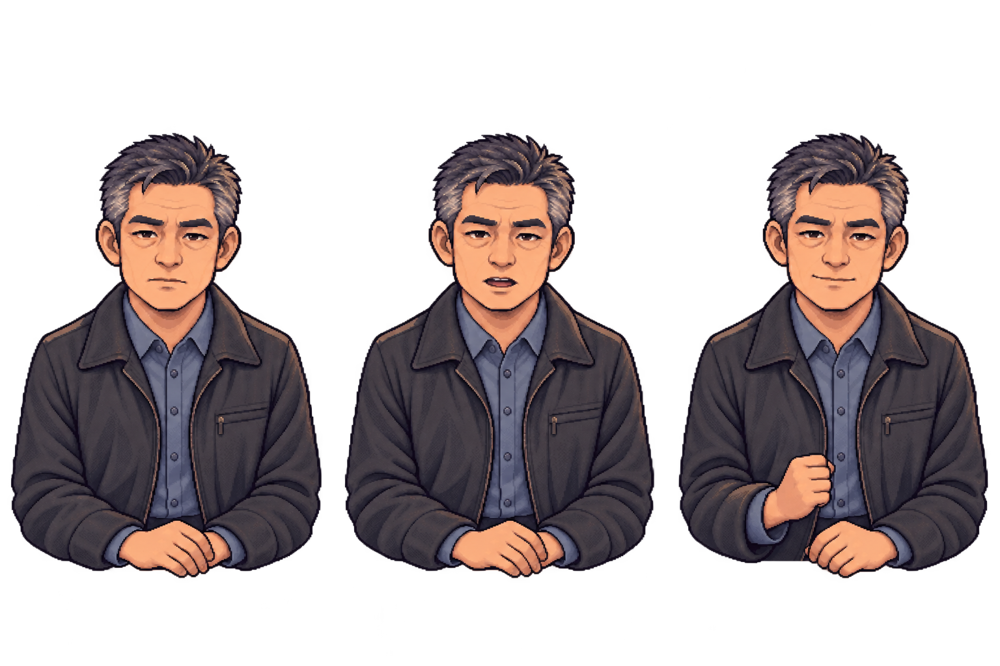
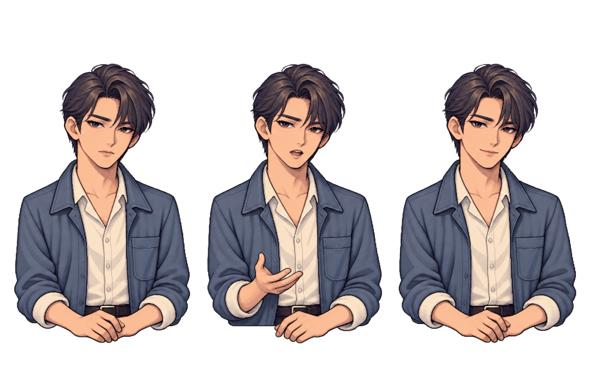
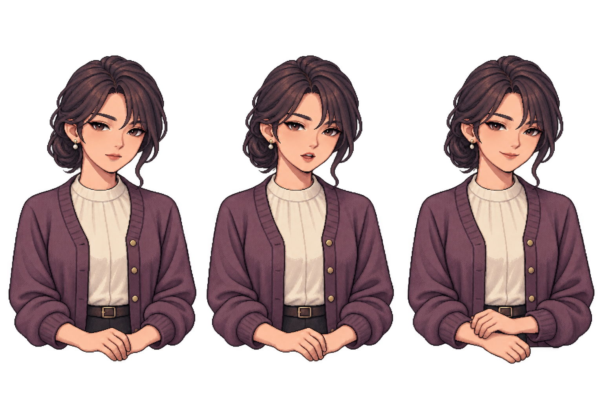
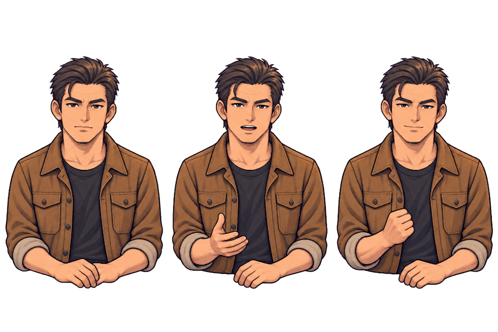
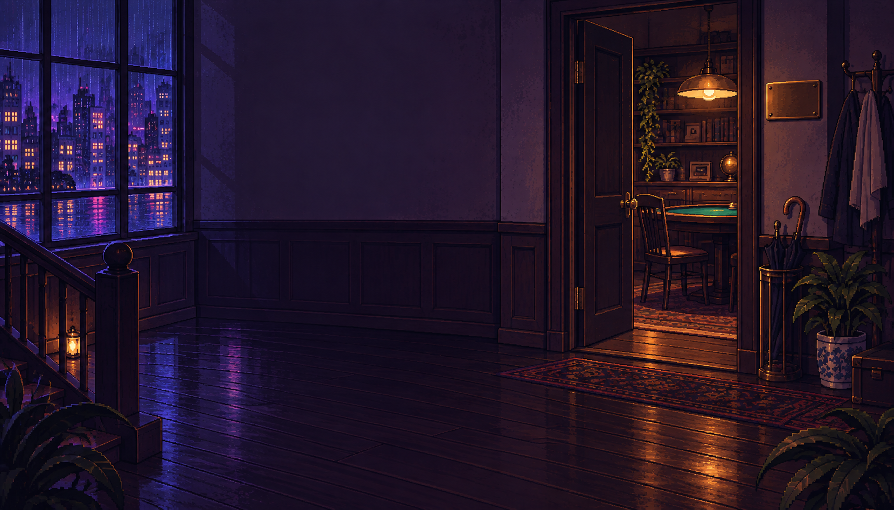

# 夜局 · 扩展美术资源包 v1

后续接入更新（2026-10-01）：下列四张选定人物 v2 图集已原样复制到 `src/web/art/` 并接入本地 Node／Pages 运行时。雨夜入口仍未接入；下文的生成状态与 manifest 保留为当时的素材审阅记录。本次接入没有重新生成、修改 PNG 像素或发布线上版本。

生成日期：2026-09-27。使用内置 **image_gen**，沿用现有夜牌室与人物图集作为画风参考。状态：**新外形提案与待接入素材**，不是新版本实机截图；游戏规则、在线 Pages、存档及运行服务均未改动。

## 本批选定素材

| 角色 / 场景 | 文件 | 内容 |
| --- | --- | --- |
| 老周「岩石」 | [rock-v2.png](rock-v2.png) | 方正轮廓、灰蓝衣装、稳重克制 |
| 程墨「小刀」 | [small-ball-v2.png](small-ball-v2.png) | 纤长轮廓、浅袖口、小幅试探手势 |
| 苏蔓「伏蛇」 | [trapper-v2.png](trapper-v2.png) | 低髻、灰紫开衫、安静聆听 |
| 韩烈「重锤」 | [value-bettor-v2.png](value-bettor-v2.png) | 宽肩、赭色衣装、沉稳有力 |
| 雨夜牌室入口 | [entrance-rain-v1.png](entrance-rain-v1.png) | 城市雨窗、半开的暖光房门、菜单留白 |

四张人物图集各有三个姿态，从左到右固定为 **常态 / 说话 / 公开获胜**。合计 12 个姿态、1 张场景；并非 12 个独立 PNG 或连续动画帧。所有服装、年龄和脸型属于本批美术提案，不新增剧情事实或更改策略。苏蔓昵称以代码 `CHARACTERS.trapper` 的「伏蛇」为准，早期设计文档中的「伏线」不作为本批命名依据。

选定素材见上方逐文件链接；本地重复 ZIP 不纳入 Git。[完整提示词](prompts.md) · [机读清单与检查结果](manifest.json)

## 预览

### 老周「岩石」



### 程墨「小刀」



### 苏蔓「伏蛇」



### 韩烈「重锤」



### 雨夜牌室入口



## 规格与质量检查

- 人物：1536 × 1024、8-bit RGBA、横向三格；每格 512 × 1024。PNG 解码确认每格有真实 alpha=0 区域和大量 alpha≥250 人物像素，并非绘制黑底或棋盘格。
- 初稿 `*-v1.png` 的部分肩袖触碰分格边缘，因此通过 image_gen 做了一轮留白修正。选定的是 `*-v2.png`，**12 格的近不透明人物像素均不触碰左右格线**。初稿保留以便对照，不包含在选定素材 ZIP 内。
- 入口：1659 × 948、RGB、不透明。无烘焙文字、菜单按钮、牌局数字；实际菜单须使用 DOM 另行叠加。
- 已逐张目视检查身份、衣装、帧序与手部轮廓，执行只读尺寸/透明度/分格边界检查。没有宣称逐像素人工修图、完美统一像素网格或实机动作验收。
- 四位人物各自三帧的头顶高度接近；**跨人物头顶和身体占幅仍不同**。修正图未严格达到提示词期望的 50 px 留白，实际主要轮廓最小侧边距约 13–41 px，但均已脱离格线。接入时应依据 `manifest.json` 的实际轮廓设置各角色锚点，不直接套用现有三名 NPC 的统一偏移。
- 个别帧存在轻微自然面部/衣纹差异，属于生成式静态姿态；不是骨骼动画、Live2D 或精确口型同步。

只读复验（在仓库根目录）：

```sh
node docs/design/pixel-night-v1/expansion-v1/inspect-assets.mjs
```

加 `--draft` 可查看初稿的贴边数据，但不执行最终版的零触边断言。

## 后续接入边界

1. 在确认外形后，将选定图集复制到 `src/web/art/` 并更新固定角色映射、Node 静态白名单、Pages 构建及预览文件清单。本次**没有**修改这些运行时代码。
2. 按实际人物轮廓统一桌面、六人桌和手机中的脸部可见大小与桌沿基线，检查切帧时无明显跳动。
3. 表情只绑定当前已播放的公开发言、公开发奖事件；不根据 AI 强牌、诈唬意图或隐藏底牌切换脸部。
4. 入口图适用于主页或序章入口；不要用它遮住真实牌面、合法操作或保存状态，也不把图中的桌椅当成已经实现的新场景交互。

原始生成文件保留在生成工具默认目录；本目录已保存可用副本与生成标识。没有使用第三方游戏原素材，没有新增第三方字体或改变项目 `UNLICENSED` 政策。
