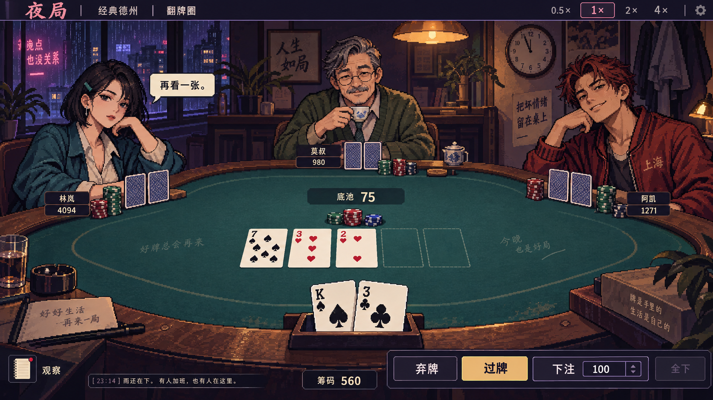
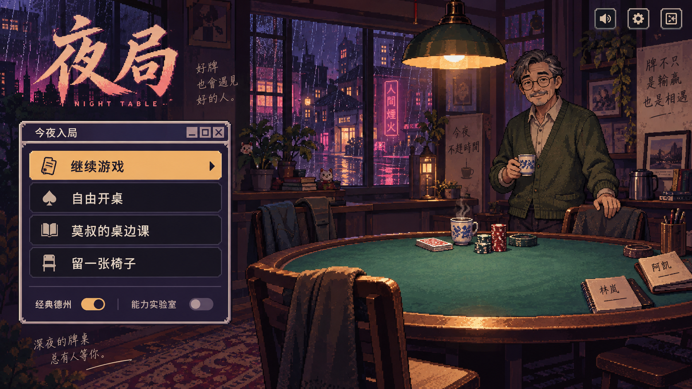
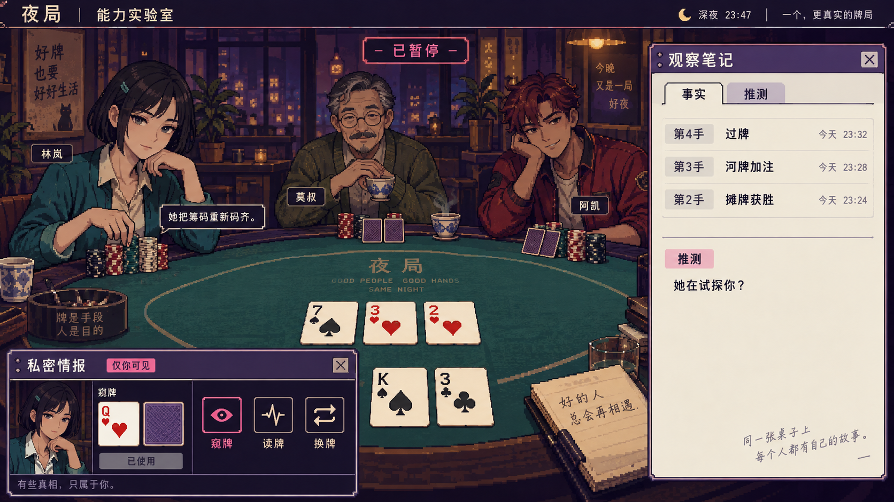

# 夜局：像素夜牌室 UI 升级计划

日期：2026-09-26 · 状态：设计提案，尚未实施 UI 改造。

## 1. 方向与边界

把现在的「德州功能页面」变成「你走进了一间有人等你落座的深夜牌室」。采用 **像素场景 + 有表演的角色席位 + 克制的复古窗口**，保持真正德州的牌面、筹码、合法操作与结算可读。

这次交付为计划和三张生成式概念图，不是实机截图、可运行新版本或已完成的美术资源包。概念中的人物外貌、场景和文案是提案，不擅自变更已有角色设定。未改引擎、运行服务、用户存档或现有未提交工作。

## 2. 从参考中取什么

以下是依据官方公开画面所作的设计拆解，不是开发者对设计意图的陈述，也不是对三款游戏的完整实机评测。

| 参考 | 借鉴 | 转化为夜局 | 不照搬 |
| --- | --- | --- | --- |
| [酒鬼女神的酒诡 / Drunken Goddess Reflux](https://alliance-arts.co.jp/en/products/drunken-goddess-reflux/) | 对手直面玩家、人物占据视觉重量，环境灯光形成亲近与压力 | NPC 上半身与桌面相连，轮到谁时视线与小动作聚焦谁 | 原角色、服装、场景、饮酒规则；它也不是纯像素美术参考 |
| [主播女孩重度依赖](https://store.steampowered.com/app/1451940/NEEDY_STREAMER_OVERLOAD/?l=schinese) | 复古桌面、窗口层级、人物与聊天共同叙事 | 观察笔记、能力结果、教学提示采用统一小窗口语言 | 同款角色、桌面拼贴和满屏弹窗；不凭空新增精神数值 |
| [Balatro 官方媒体包](https://www.playbalatro.com/press-kit) | 有触感的像素卡牌、鲜明数字、克制但有效的反馈 | 重做牌面、筹码、按钮按压、揭牌与赢家高亮 | Joker、乘区分数、倍数爆炸、原素材与同款布局 |

《酒鬼女神的酒诡》在本次查阅的 Steam 页面中尚标为未推出，参考限于公开宣传画面。查阅日期同上。游戏名和官方图片仅作研究引用，不作为项目可再分发资产。

## 3. 当前诊断

已查看本地运行中的主页、项目 UI 源码与已有实战截图。现版已有播放速度、牌桌动画、人物气泡、观察记录、教学和续局能力，并非没有交互；问题在于它们缺少统一的视觉表达。

- **场景不成立**：暗底和椭圆桌提供功能，但缺少光源、空间层次、生活物件与进入牌室的感觉。
- **角色重量不足**：姓名/文字头像难以承接已经存在的性格、公开事件和反应。
- **层级偏平均**：牌桌、模式说明和辅助面板容易读成同等级的工具栏。
- **反馈不成体系**：下注、亮牌、观察与能力需要不同强度和相同规则的表达。
- **隐藏能力难被发现**：观察/记忆并不总能在牌桌上留下可感知的入口和痕迹。

保留现版「一屏完成主要决策」的成果；不能为了大立绘把行动按钮重新挤出屏幕。

## 4. 紧凑视觉系统

### 配色

| Token | 色值 | 职责 |
| --- | --- | --- |
| 深梅夜 | `#1B1730` | 背景、轮廓、窗口投影 |
| 旧屏紫 | `#41325B` | 窗框、非主要控件 |
| 桌毡青 | `#24554F` | 牌桌与安静的环境中层 |
| 票纸白 | `#F3E6C7` | 牌面、主要文字、纸质记录 |
| 霓虹莓 | `#F07BA3` | 能力与特殊叙事，避免常驻大面积铺满 |
| 筹码金 | `#E7B866` | 当前行动、主要按钮与获胜焦点 |

花色仍保留清晰红/黑符号；不把花色映射为主题色导致误读。错误、焦点、选中也须有符号和文字，不能仅靠颜色。

### 字体与像素密度

- 展示字：少量中文像素字用于标题、席位昵称与短标签；具体字体在实施前核对中文覆盖和开源/商用授权。
- 正文：现有系统中文无衬线栈（PingFang SC 等），通常 14–16 CSS px；长篇观察和教学不强制点阵。
- 数字：等宽数字，筹码和跟注额使用稳定列宽。像素数字字体待授权确认，可先用系统 monospace。
- 图像采用整数像素网格、有限色阶、局部抖动纹理；UI 文本依然是 DOM 文本，不能烘焙进背景图。
- 场景可按 640×360 的美术网格设计，角色采用 96×128 或 128×160 的基准；实际切图规格在首张可用角色资产验证后定稿。
- 装饰图层用近邻缩放，容器负责响应式布局；不把整张页面当一张图缩小，也不对全文应用 pixelated。

### 布局与独特记忆点

一句话布局：**中间是最高对比的真实牌桌，人物在桌沿形成席位，底部固定自己的牌和合法操作，辅助窗口只在需要时出现。**

独特记忆点是「像素席位剧场」：NPC 的肩膀和手部适度探出席位框，在同一张桌上完成看牌、理筹码、推注和短句反应。不是三张互不相干的头像卡片。

```text
桌面：
┌ 夜局 / 模式 / 手数 ───────────── 速度 · 设置 ┐
│         NPC 席位与克制的环境灯光              │
│  NPC       公共牌 / 底池 / 下注标记      NPC  │
│            最多一个主要反应气泡              │
│  观察入口      我的手牌与筹码       能力入口  │
├ 弃牌 ─ 过牌/跟注 ─ 加注到 [金额] ─ 全下 ────┤
└ 一行公开事件 / 可展开历史 ─────── 保存状态 ──┘

手机：
┌ 模式 / 手数 / 简化控制 ┐
│ NPC 紧凑席位与当前气泡 │
│     公共牌与底池       │
│     我的牌与筹码       │
├ 固定操作区 / 加注展开 ┤
└ 观察、能力 → 底部抽屉 ┘
```

### 方案自检

- 不采用全屏粉紫窗口堆叠：很像参考，但会淹没真实德州决策。
- 不采用所有座位同样大的全身立绘：6 人桌和手机会失效。人物上半身随布局收缩，完整人物只进入可关闭的详情窗。
- 不以重 CRT、闪屏、抖动制造复古感：默认只允许轻微环境颗粒，可关闭；文字层不受扭曲。
- 不用 UI 表情暗示未知底牌强弱：真人感来自已公开行动和角色习惯，不来自给玩家额外透视。

## 5. 概念图

同一方向的三处界面，而非三套互相竞争的皮肤。生成图用于确认氛围、构图和角色重量；牌局数字及文字均为构图示意，不作为规则、交互或结算验收依据。

### 01 — 实战牌桌



核心检验：先看到手牌、公共牌、当前行动和跟注额，再注意到角色。经典模式无能力入口；能力模式才出现特殊窗口和莓色提示。

### 02 — 夜局主页



核心检验：有进入一间牌室的场景感，同时继续游戏、自由开桌、教学和现有短篇入口一眼可找。没有存档时不显示可用的继续按钮。

### 03 — 人物观察与能力窗口



核心检验：人物值得观察，事实与推测明确区分；能力结果只在玩家私有窗口展示。概念图为了比较组件可并列展示，实装不会默认同时打开所有窗口。

### 概念图审阅后的落地修正

- 图 01 的人物存在感、桌面层级和暖冷光对比可作为主视觉标杆；它是四人桌构图，不能原样压缩成六人桌。
- 图中的牌面点数装饰、筹码堆数量和按钮禁用态不具有规则权威性。例如「可以过牌」不自动意味着「全下不可用」；实装必须用合法操作驱动按钮。
- 图 03 的事实/推测与「仅你可见」分区成立，但人物的完整牌背在这张概念里并非全部清楚，正式渲染仍必须给每个有手牌的席位保留准确显示。
- 图片生成带来的墙面、桌面励志标语偏多，正式场景删减，只保留少量具有牌室来历的道具，不把角色空间变成口号墙。
- 观察详情不能长期压缩牌桌；笔记采用稳定状态打开的侧窗/抽屉，检查结束回到完整桌面。图中暂停标签并非已实现功能。
- 三张图只是方向一致的独立生成，正式人物要统一脸型、发饰、服装和像素密度后重新生产；不直接裁三张图当成标准角色表情集。
- 图 02 的两种规则在视觉上像两个独立开关，实装改为互斥选项，避免误以为可同时开启。窗口装饰按钮若无真实功能则删除，不制造假控件。

## 6. 各页面与组件升级

| 区域 | 要做的变化 | 必须保持 |
| --- | --- | --- |
| 主页 | 从空牌桌预览改为夜牌室场景；主菜单嵌入小终端；续局像留席签 | 继续存档、2–6 人自动 NPC、两种规则、人物互动开关、教学与短序章均可找到 |
| 自由开桌 | 点击后展示紧凑设置窗，而非让所有设置长期占用主页 | 只选人数，不强迫玩家逐个选 NPC；新开桌覆盖存档的现有说明与确认不弱化 |
| 牌桌 | 环境、桌面、人物、牌/筹码、气泡、辅助窗分层；非当前席位视觉收敛 | 按钮/小盲/大盲、弃牌/全下/淘汰、当前行动明确，不能只用立绘表情代替状态 |
| 卡牌 | 原创纸色牌面、大角标、真实花色、统一牌背，选中牌抬高；强弱比较时突出最佳五张 | 公共牌/底牌边界清楚；不可见牌始终牌背；不能借阴影、翻转途中或 DOM 属性泄漏 |
| 筹码与底池 | 实体筹码堆传达下注动作，数值标签传达精确数量 | 图案不取代数字；清楚区分「本轮已下注」「本手总投入」；加注仍明确为「加注到」 |
| 行动区 | 固定底栏；跟注按钮显示真实需补金额；加注输入 + 合法范围 + 快捷额 | 金额/命令来自引擎，短码跟注显示真实全下数额；过牌与跟注按状态互斥；播放期间锁定 |
| 人物气泡 | 发言用引号与姓名；观察用动作图标和不同纸条形状；贴近对应人物 | 保持事件锚定；最多一个主要气泡；可收起闲聊；过长内容进入记录，不覆盖牌面和行动条 |
| 观察笔记 | 常驻小入口 + 新记录角标；点开纸质窗口；按当前人物或最近交锋查看 | 事实与推测分区；手数和公开依据可查；角标不能声称已发生尚未播放的未来事件 |
| 能力 | 窥牌/读牌/换牌采用三枚原创符号；选目标高亮席位或自己的某张牌；私密结果窗 | 仅能力模式出现；次数、当前可用命令、每次决策限制由现有状态决定；读牌只是已有粗粒度信息，不变成精确胜率 |
| 教学 | 莫叔小像 + 一句当前目标；高亮当前可操作区；按需打开术语小卡 | 继续现有三关真实引擎练习，不播放一段假牌局代替教学；避免同时弹出多个解释 |
| 短序章 | 对话框融入桌边；发言选择和下注操作视觉上分开；结束像一张当夜记录 | 仍是现有六手短序章，不在 UI 任务中承诺新增完整故事、关系养成或分支系统 |
| 摊牌/结算 | 最佳五张逐一标记；赢家收筹码；先展示「谁赢、为什么」，再展开账单 | 主池与边池分别给谁、总收入/投入/退回/净结果可核对；不把收入当净赢，也不把同牌型都当平局 |
| 保存/异常 | 留席签与保存状态同一设计语言；断线/保存失败使用明确文字横条 | 仍只恢复最后结算；不要把「保存过」误写成「当前这一手已保存」；不静默清空或迁移存档 |

## 7. 角色美术与「活人感」

现有性格以 `src/game/table-personas.ts` 为依据；下表的外貌、衣物与动作演出是新美术提案，需要用户看图后确认。

| 角色 | 已有性格抓手 | 建议轮廓 / 色彩 | 第一批表现 |
| --- | --- | --- | --- |
| 林岚「猎手」 | 理齐筹码，观察别人，不愿认错 | 成年女性，利落黑短发，青色外套 | 平静注视、整理筹码、公开结果后的轻微失落或点头 |
| 阿凯「疯狗」 | 外放，想被认真对待 | 成年男性，凌乱棕红发，砖红夹克 | 身体前倾、推注、公开胜负后的笑或撇嘴 |
| 莫叔「跟注站」 | 给人留台阶，旧事欲言又止 | 年长男性，眼镜，苔绿衣物，茶杯 | 欢迎、耐心讲解、停顿喝茶 |
| 老周「岩石」 | 少言，筹码靠近身体 | 方正轮廓，深灰外套 | 抱臂/护住筹码的中性姿态 |
| 程墨「小刀」 | 一小步一小步试探 | 纤长轮廓，浅袖口 | 拈一枚筹码的中性姿态 |
| 苏蔓「伏线」 | 聆听，反问，耐心 | 柔和轮廓，低饱和紫 | 侧头倾听的中性姿态 |
| 韩烈「重锤」 | 有分量，认真 | 宽肩轮廓，赭色 | 稳定落手的中性姿态 |

主角先保持普通人的第一视角，不急着固定长相；玩家身份与 NPC 演出分开。图中的林岚/阿凯/莫叔外形不是既有剧情事实。

**表演绑定规则**：等候 = 中性待机；轮到行动 = 轻微视线/手部变化；公开下注 = 推注；公开结算 = 胜负反应。没有公开依据时不能因 AI 内部强牌、诈唬或私有随机数切换「得意」「心虚」。习惯动作不是读牌外挂。UI 升级能够强化已有 AI 的可感知个性，但不等于已经升级决策智能或实现自由聊天。

### 分层资产清单

- 一套夜牌室分层背景：远景、室内、桌面、前景，各层允许不同断点裁切。
- 一套卡牌系统：统一牌框、4 花色、13 点数、牌背、空槽、选中/最佳五张态；不需要让生成模型一次画准确 52 张。
- 一套筹码、D/盲注、观察、记录、声音、速度、能力图标；按钮常态/悬停/按下/禁用/键盘焦点。
- 第一阶段三名核心角色各 3 个有用姿态；其余四人先有一致风格的中性头像/半身像，再补动作。全桌布局通过后才扩大表情量。
- 教学小头像、结算票据、私密情报窗、保存状态属于同一组件族，不逐页拼新样式。
- 所有正式资产保留来源、许可与生成记录。概念图需重新切分、清理透明边与统一像素网格，不能直接铺为整张不可点击页面。

## 8. 动效与可调节节奏

沿用当前 `PlaybackFrame` / `PlaybackClock` 的事件顺序、速度与跳过机制；视觉动效不另建一条独立计时线。

| 事件 | 建议视觉动作 | 动画本体基准时长（1×，非整段停留时间） |
| --- | --- | --- |
| 悬停 / 按下 | 小幅抬起、2 px 按压、描边切换 | 80–140 ms |
| 发牌 / 翻牌 | 短距离滑入，先背后正面，逐张揭开 | 220–420 ms |
| 跟注 / 加注 | 手部推注、有限数量筹码移动、数字同步 | 250–400 ms |
| 角色发言 | 气泡轻弹，正文一次出现；不强制逐字等待 | 120–200 ms |
| 能力结果 | 局部莓色边缘闪一次，私密窗出现 | 180–320 ms |
| 底池发放 | 正确赢家高亮，筹码分池移动，账单稳定显示 | 350–650 ms |

这些是待试玩校准的目标，而非测得结果。时长随现有 0.5×/1×/2×/4× 控制变化，长文本的可读停留由事件播放器协调。跳过必须立刻到正确最终状态并清理视觉层；不得为了等动画阻止合法操作恢复。

默认不震屏、不连续闪烁、不用胜负音量压过内容。`prefers-reduced-motion` 禁用位移/抖动类演出，并提供轻动效选项。像素点击声、推筹码声可作为后续可静音增强项，不放入首批美术交付的必要依赖。

概念 03 中「已暂停」是检查界面构图的说明，不表示当前产品已有暂停按钮。第一版优先在待玩家决策或结算的稳定状态打开笔记；如增加播放暂停，必须扩展现有时钟并验证恢复/变速/跳过组合，不靠 CSS 假暂停。

## 9. 技术落地边界

保持 TypeScript + 当前 DOM 渲染结构，不为这次皮肤改造引入 React、Canvas 游戏引擎或 WebGL。CSS 布局加像素资源足以实现目标。

| 现有位置 | 拟修改职责 |
| --- | --- |
| `src/web/style.css` | 设计 token、桌面/手机排布、像素窗体与层级；需要时拆分主题样式，但不在首步大规模重构 |
| `src/web/render.ts` | 主页/席位/卡牌/底池/行动/结算的新呈现；保留 `data-action`、牌桌身份、合法操作与金额来源 |
| `src/web/experience-render.ts` | 教学、剧情、观察与记忆窗；公开依据与推测标签保持清晰 |
| `src/web/client.ts` | 窗口开关、焦点返回、加注草稿保持、资源/动效应用；沿用现有请求锁与播放生命周期 |
| `src/web/playback.ts` | 复用事件锚定与变速/跳过；只有明确的新播放需求才动这里 |
| 新增静态资源目录（接入前核对服务器白名单） | 原创背景/角色/图标及许可清单；不把图像路径或任意文件读取权限扩散到服务端 |

默认不改 `core`、NPC 策略、能力规则、`TurnPacket` 或存档模型。美术状态从当前公开视图/事件映射，绝不将未公开牌面注入 `data-*`、CSS 类、图片名、无障碍标签或浏览器日志。

只改样式/前端时也要核对现有存档兼容性校验所覆盖的文件，不能假定任何源代码改动都一定兼容；若实际触及存档指纹边界，先告知影响，不能通过清空 `.holdem-data` 或弱化校验解决。

绘制层级建议：环境 → 桌面 → 人物与席位 → 卡牌/数值 → 行动条 → 当前气泡 → 明确打开的检查窗口。行动条不被背景动画或人物透明区域截获点击。抽屉/弹窗提供关闭按钮、Esc 和焦点返回；不能在已有请求处理中重复提交。

## 10. 分阶段交付与关口

不先做数周的全员立绘库。先完成能打一手、能看出差异的纵向切片。

### A — 主牌桌纵向切片（优先）

- 一张夜牌室背景、全新牌面与行动条、三位核心人物基础表演、统一像素控件。
- 先拿 4 人经典桌做视觉标杆，同时确保 2–6 人布局可玩；其他 NPC 临时保留清楚的回退头像，不冒充全员已完工。
- 从翻牌前打到摊牌/弃牌胜出；交付同一状态下的新旧截图对比。
- 关口：玩家不用滚动找行动按钮，3 秒内认出自己的牌、轮到谁、需要跟多少；至少完成一手主观体验后才扩大制作。

### B — 人物、观察与能力统一

- 补齐七名 NPC 中性像；核心三人的姿态完成一致性清理。
- 发言/观察气泡、笔记新记录提示、三能力入口与私密结果、摊牌与边池账单统一。
- 关口：从「看到一个反应」可以追溯到「哪次公开行动」，经典界面完全不出现能力组件。

### C — 主页、教学与短序章

- 实现图 02 的夜牌室入口，明确续局和自由开桌；将教学与短序章带入同一世界。
- 保存/未保存/失败状态跟随新界面，不扩大恢复承诺。
- 关口：完全不懂德州的人能从主页找到教学，知道何时轮到自己，并独立完成第三关；有存档的人可看懂恢复边界。

### D — 移动端、资源与可访问性收尾

- 精调手机紧凑席位/底部抽屉、键盘导航、轻动效、图片加载与清晰度。
- 删除调试和重复美术资源，补资产许可/来源清单与 README 展示（发布仍需当前授权）。
- 关口：2/4/6 人、桌面/手机、经典/能力、教学/故事、结算/恢复都有可核验截图与最小流程记录。

## 11. 最小验收矩阵

本次计划没有重新运行产品测试；以下是将来实施的验收要求，不是已通过结果。避免盲目增加随机对局次数，优先覆盖 UI 真正会破坏的地方。

| 检查 | 通过标准 |
| --- | --- |
| 1280×720 桌面、390×844 手机，2/4/6 人 | 核心决策区域不被遮挡，无横向溢出；小屏辅助内容可进抽屉，操作区可触达 |
| 经典 / 能力模式 | 经典无能力 UI；能力次数/目标合法性与服务器一致；耗尽和不可用态清楚 |
| 金额边界 | 普通跟注、短码全下、最小加注、最大加注都显示真实投入；金额输入不因刷新失焦或变成别的数 |
| 信息边界 | 翻牌前看不到公共牌；对手未亮牌保持隐藏；表情/记录不提前揭示后续事件 |
| 播放 | 0.5×/1×/2×/4×、中途变速、跳过均到达同一状态；无重复下注、残留筹码或旧气泡 |
| 可读性 | 长昵称、较长中文气泡、四位以上筹码、主池+边池、并列赢家都不截掉关键内容 |
| 操作与无障碍 | 主触控按钮目标至少 44×44 CSS px；键盘焦点明显；Esc/关闭返回原控件；轻动效可用 |
| 存档 | 保存失败能看见；仅最后结算可恢复；同浏览器/地址的已有可兼容存档不因换皮被删除 |
| 主观体验 | 由用户实际试玩一手判断人物是否更有存在感、界面是否更清楚；截图美观不等同于体验通过 |

实施时运行类型检查、构建及受影响的渲染/客户端/播放/交互/存档定向测试，再做隔离牌局的浏览器流程；不擅自操作用户正在玩的那桌。

## 12. 推荐决策

建议采纳本方向并先做 A：**牌桌和人物的第一印象先改变，既有玩法保持稳定**。暂缓完整自由聊天系统、NPC 策略升级、长篇剧情、换引擎和 Live2D；它们都不能替代本轮的 UI 可读性与美术完整度。

用户看图时重点判断：更喜欢偏温暖旧牌室还是更强莓色怪诞感；核心三人的外形是否符合心中的角色；牌桌与人物的面积比例是否舒服。若总体方向认可，实施前只需围绕这三点调整，不再重启一次大范围产品规格讨论。
