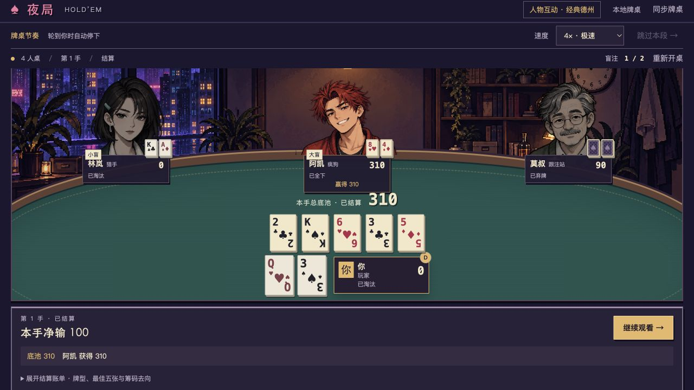
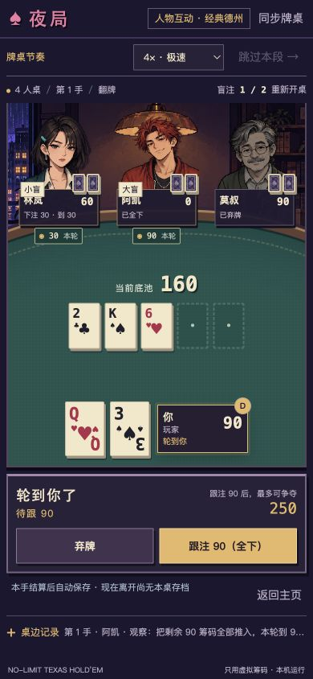
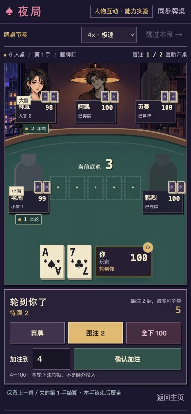
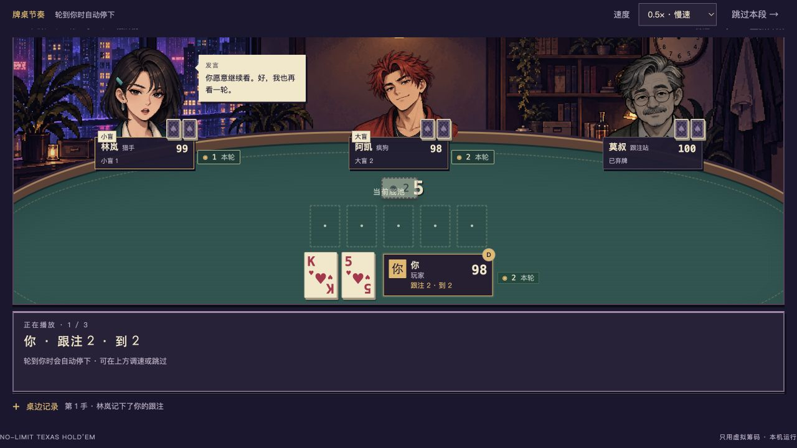

# 像素牌桌阶段 A 验收 — 2026-09-26

## 范围

真实 DOM 牌桌、人物图集、环境、卡牌、操作栏。保留原有规则、播放队列、速度与跳过、私有能力、教学、人物观察和结算存档；没有更改 NPC 策略。

## 自动验证

- `npm run check`：通过。
- `npm run build`：通过。
- 八个网页测试文件，共 60 项通过：render / client / playback / server / experiences / social-feedback / checkpoints / pixel-table。
- 新增覆盖：公开事件选择表情、未知人物仅用占位图、HTML 转义、固定资产 URL、PNG 实际透明度、资源缓存与 API 不缓存。
- `git diff --check`：通过。

## 浏览器实测

使用独立 `http://127.0.0.1:4181/` 和测试牌桌，视口为 1280 × 720 与 390 × 844。

- 四人经典：实际发牌，跟注 2，再跟注 8，翻牌跟注剩余 90 全下。自动发完公共牌 2♣ K♠ 6♥ 3♣ 5♦，阿凯赢得底池 310，显示获胜表情，结算保存到第 1 手。没有伪造牌局状态。
- 四人手机：人物姓名、剩余筹码、下注标签、公共牌、自己的牌和按钮无重叠；文档没有横向溢出。
- 六人能力桌：三位非核心人物使用带姓名的剪影。手机中央牌缩小到 33 × 49，避开两侧席位。偷看林岚消耗一次能力；私有栏显示 4♥，林岚公开席位仍为两张牌背，正常跟注操作仍可用。
- 双人教学：莫叔立绘、教学提示、盲位和合法操作可见；推荐的“跟注 1”可执行。
- 三人桌面和五人手机分别实测，公共牌通道不被席位侵占；没有把有限视口检查声称为全设备覆盖。
- 0.5× 慢速实测林岚发言：说话表情与公开气泡同步显示，下注筹码沿原有播放队列移动。

### 真实浏览器截图

## 已知边界

- 本阶段只完成林岚、阿凯、莫叔三个人物；主页和人物笔记仍沿用原交互，不代表全产品 UI 升级已完成。
- 生成原图约 7.7 MB，已启用版本化缓存，首屏压缩仍有优化空间。
- 资源路由修改触及现有 `engineFingerprint` 对服务端文件的校验：旧版本结算存档不能直接在新版本恢复。本次不弱化校验、不删除旧文件、不自动迁移。4180 原服务未被重启；请在 4181 体验新版。
- 两个进程仍共享工作目录中的前端文件；独立端口隔离会话和存档，并非完整冻结旧版静态资源。
- 没有推送 GitHub 或发布 Release。
